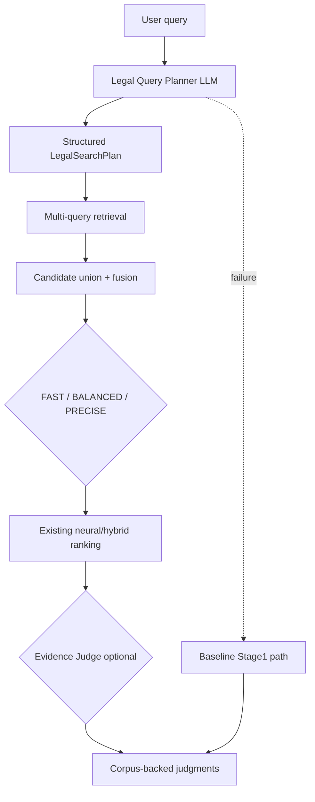

# NALUS Legal v2 — LLM Retrieval Augmentation Plan

**Status:** AUTHORITATIVE FUTURE ROADMAP (documentation only)
**Date:** 2026-08-14
**Git baseline at authoring:** `bb5084c` (`feat/legal-retrieval-benchmark`)
**Related:** `docs/legal_v2/PRODUCTION_ASYNC_ARCHITECTURE_PLAN.md`
**Independence:** Does **not** alter embeddings, chunking, A/B indexes, ColBERT, or the running FULL A build.

---

## 1. Executive Summary

### What the current retrieval engine already does

Legal v2 Stage 1 product search (`POST /api/rag/legal-v2/case-similarity/search`) is intentionally **LLM-free**:

1. `QueryInputService.prepare` — normalize / optional extractive long-input condensation
2. `build_query_spec_v2` — deterministic QuerySpec + rule-based retrieval query expansions
3. Profile-resolved retrieval:
   - **FAST** → A hybrid (BGE-M3 + BM25 + RRF)
   - **BALANCED** → B hybrid + ColBERT → RRF
   - **PRECISE** → B hybrid shortlist + CrossEncoder CE-7
4. Corpus-backed document/passage results only

Separately, a gated pipeline `search_legal_v2` already uses DeepSeek for QuerySpec interpretation and semantic verification — **not** the Stage1 product path.

### Why an LLM layer can help

Rerankers (ColBERT / CE) can only promote what Stage 1 **retrieved**. Frozen-query and human GOLD/SILVER grading already showed **candidate coverage** failures: wrong domain contamination, relevant judgments present deeper or missing from candidates, colloquial intent under-represented by literal wording.

LLM query intelligence targets:

```text
RECALL BEFORE RERANKING
```

### What it must never do

- Invent ECLI / case numbers / holdings / quotations
- Replace corpus retrieval with generative “case guessing”
- Become a single point of failure for search
- Block the FastAPI event loop (must obey the async plan)

### Fit on FAST / BALANCED / PRECISE

| Profile | Initial LLM role |
|---|---|
| FAST | **No LLM** — deterministic baseline / control / fallback |
| BALANCED | Optional bounded planner later (Phase 7) |
| PRECISE | Primary home for planner (+ optional Evidence Judge) |

### Grounded answers (later)

Answer generation is **Phase 8+**, only on validated retrieved evidence.

### Non-negotiable principle

```text
Retrieval discovers the evidence.
LLM intelligence improves the search strategy.
The corpus remains the source of truth.
```

---

## 2. Current Legal v2 Retrieval Architecture

### Actual Stage1 code path (product)

```text
app/api/rag_router.py
  async def case_similarity_stage1_search
    → await search_case_similarity_stage1
        app/rag/legal_v2/retrieve/case_similarity_search.py

search_case_similarity_stage1
  QueryInputService.prepare          # query_input/service.py
  build_query_spec_v2                # query/query_spec.py
  resolve_retrieval_profile          # retrieve/retrieval_profiles.py
  FAST:
    asyncio.to_thread(LegalV2HybridRetriever.retrieve)   # retrieve/retriever.py
      QdrantDenseStore.search + BgeM3Embedder.embed_query
      Bm25Sidecar.search
      rrf_fuse
  BALANCED:
    retrieve_hybrid_plus_colbert     # retrieve/colbert_hybrid.py
  PRECISE:
    hybrid retrieve → CE rerank      # rerank/service.py
```

### Mermaid — current Stage1

```mermaid
flowchart TD
  U[User query] --> EP[case_similarity_stage1_search]
  EP --> PREP[QueryInputService.prepare]
  PREP --> QS[build_query_spec_v2]
  QS --> PROF[resolve_retrieval_profile]
  PROF -->| FAST
  PROF -->| BALANCED
  PROF -->| PRECISE
  FAST --> HYA[LegalV2HybridRetriever A]
  BALANCED --> HYB[Hybrid B + ColBERT gather]
  PRECISE --> HYC[Hybrid B]
  HYC --> CE[CrossEncoder rerank]
  HYA --> OUT[Stage1 documents]
  HYB --> OUT
  CE --> OUT
```

### Already present (do not reinvent blindly)

| Piece | Location | Role vs this plan |
|---|---|---|
| Deterministic QuerySpec expansions | `query/query_spec.py` `_build_retrieval_queries` | Keep as baseline / fallback expansions |
| Long-input extractive SearchBrief | `query_input/providers/extractive.py` | Not legal planner; condensation only |
| PreciseLLM SearchBrief **stub** | `query_input/providers/precise_llm.py` | Placeholder only — raises |
| DeepSeek QuerySpec interpreter | `interpret/interpreter.py` | Used by gated `search_legal_v2`, not Stage1 |
| DeepSeek semantic verifier | `verify/verifier.py` | Post-retrieve constraint verification on gated path |
| Generic LLM factory | `app/rag/llm/provider_factory.py` | Reuse for providers |
| Legacy rewrite service | `app/rag/rewrite/query_rewrite_service.py` | Not on Stage1; study patterns only |

---

## 3. Problem Statement

LLM query intelligence should address:

| ID | Failure class | Symptom |
|---|---|---|
| A | Colloquial vs legal terminology | “soud ignoroval důkazy” ≠ “opomenutí důkazů / povinnost odůvodnění” |
| B | Vague wording | Under-specified legal issue → weak dense/BM25 match |
| C | Multi-issue queries | One literal string buries secondary legal dimensions |
| D | Domain ambiguity | Civil/admin contaminated by criminal candidates |
| E | Synonyms / alternate formulations | Missed doctrine phrasing |
| F | Cross-border terminology | Hague / Brussels / foreign labels vs CZ holdings |
| G | Candidate coverage failures | GOLD exists in corpus but not in Stage1 candidate set |
| H | Facts without legal labels | Narrative facts without doctrine keywords |

Primary metric to improve: **Did the known relevant judgment enter the candidate set at all?**

---

## 4. Target Architecture



### Layers

1. **Pre-retrieval LLM** — Legal Query Planner (structured)
2. **Retrieval engine** — unchanged BGE/BM25/RRF/ColBERT/CE over real indexes
3. **Post-retrieval LLM** — optional Evidence Judge over retrieved passages only

---

## 5. LLM Legal Query Planner

### Input

- `original_query: str`
- optional `retrieval_profile` / user domain hint
- optional conversation context (future)

### Output — validated structure (dataclass or Pydantic; prefer dataclasses to match Stage1 runtime style, Pydantic OK in benchmark packages)

Proposed `LegalSearchPlan`:

| Field | Type | Notes |
|---|---|---|
| `original_query` | str | Required, preserved |
| `normalized_query` | str | Light cleanup |
| `probable_domains` | list[{domain, confidence}] | Multi-label |
| `primary_legal_issue` | str | Short |
| `legal_concepts` | list[str] | Doctrines/rights |
| `factual_concepts` | list[str] | Parties/facts |
| `procedural_concepts` | list[str] | Hearing/reasons/etc. |
| `statutes_or_articles_mentioned` | list[str] | From query only; no invention |
| `jurisdiction_signals` | list[str] | CZ / cross-border |
| `temporal_signals` | list[str] | Optional |
| `exclusions` | list[str] | Soft negatives |
| `rewritten_queries` | list[SearchQueryVariant] | Max N |
| `subqueries` | list[SearchQueryVariant] | Decomposition |
| `confidence` | float | 0–1 |
| `ambiguity_flags` | list[str] | Machine tags |

`SearchQueryVariant`: `{id, text, kind, weight}` where `kind ∈ {original, rewrite, doctrine, procedural, factual, other}`.

Validation: schema parse → reject → **fallback to baseline Stage1**.

---

## 6. Query Rewrite

- Translate colloquial Czech into legal search language.
- **Always keep original query as one retrieval variant** (`kind=original`, non-removable).
- Never replace the user’s query entirely.
- Cap rewrites (recommended first experiment: **1–2** besides original).

Example:

User: „Matka mi nedovolí styk s dítětem.“
Rewrites may include contact rights / best interests / enforcement of contact / family life — **plus** the original string.

---

## 7. Query Decomposition

When ambiguity/multi-issue flags fire, split into independent retrieval dimensions.

| Knob | Initial recommendation |
|---|---|
| Max subqueries | 3 (plus original) |
| Duplicate suppression | Near-duplicate cosine/Jaccard on variant texts |
| Skip decompose if | confidence high & single primary issue & short query |

Do not decompose trivial keyword queries.

---

## 8. Legal Domain Classification

Domains (multi-label): constitutional, civil, family, criminal, administrative, employment, enforcement, property, procedural, international/cross-border, other/mixed.

### Rollout of domain influence

| Phase | Behavior |
|---|---|
| A | Metadata **boost** only (score signal) |
| B | Soft filter / rerank signal |
| C | Hard filter **only after** recall evaluation proves safe |

Prior contamination (criminal into civil/admin) is addressed first via soft boosts + Evidence Judge domain check — **not** hard exclusion on day one.

---

## 9. Legal Concept Expansion

Extract/expand: doctrines, procedural concepts, rights, remedies, factual relations, statutory terms, synonyms, broader/narrower labels.

Rules:

- Expand for **search**, not as asserted law.
- Prefer concepts attested in query or high-confidence inference tagged as `inferred`.
- No fabricated statute numbers.

---

## 10. Multi-Query Retrieval

### First experiment budget (PRECISE)

| Knob | Start |
|---|---|
| Max variants total | 4–6 including original |
| Per-query top-K chunks | same as profile dense/BM25 depths or slightly reduced |
| Overall unique document budget before CE | ≤ existing `candidate_documents` (or +20% max in offline eval only) |
| ColBERT invocations | Prefer **one** ColBERT over union, not per-variant (BALANCED) |

Each variant runs hybrid retrieve (or shared dense/BM25 fan-out). Original query weight guaranteed.

---

## 11. Candidate Fusion

Candidates to evaluate offline (do not pick blindly):

1. RRF across variant lists
2. Weighted RRF (original weight > rewrite > subquery)
3. Max-score / best-rank fusion
4. Hybrid: RRF then profile reranker

**Baseline always available:** single original-query Stage1 path.

Evaluation decides the winner (§32–34).

---

## 12. Interaction with FAST

**Preferred initial principle:**

```text
FAST remains deterministic / no-LLM baseline.
```

Reasons: latency, cost, LLM outage fallback, experimental control group.

Future optional: cached planner only behind flag — not default.

---

## 13. Interaction with BALANCED

Possible later architecture: bounded planner → limited multi-query hybrid → **single** ColBERT over union → RRF.

Do **not** run ColBERT once per generated query in v1.

Latency gate: if planner+multi-query exceeds budget, fall back to baseline BALANCED.

---

## 14. Interaction with PRECISE

Primary production home for LLM planner:

```text
query → planner → 3–6 variants → BGE+BM25 multi-retrieve
  → union/fusion → CrossEncoder CE-7 → optional Evidence Judge → top K
```

Optimize for legally useful recall + ranking under:

- bounded LLM calls (planner 1; judge optional 1 batched)
- bounded candidates into CE
- existing CE GPU concurrency limits from async plan

---

## 15. LLM Evidence Judge (optional post-retrieval)

Input: original query, `LegalSearchPlan`, candidate metadata, best passages.

Output structured grades aligned with human methodology:

`GOLD | SILVER | BRONZE | MISS` (+ rationales fields that are short, non-CoT).

Questions:

- Addresses actual legal issue?
- Merely doctrinal neighbor?
- Correct domain?
- Contains relevant outcome?
- Procedural companion vs merits?

---

## 16. Outcome-Aware Evidence Evaluation

Distinguish (future fields on assessment):

- doctrine discussed vs applied
- claim accepted/rejected
- judgment overturned/upheld
- remedy granted/denied

Do **not** implement outcome extraction before offline eval proves lift over CE alone.

---

## 17. Judgment Family / Procedural Companion Awareness

Signal (soft): merits vs costs/admissibility/procedural companion (e.g. `.1` vs `.2` patterns where reliable).

Initial use: Evidence Judge / ranking feature — **not** uncontrolled hard demotion without eval.

---

## 18. Hallucination Safety

Forbidden for LLM to invent: ECLI, case number, court, date, holding, statute, quotation, judgment text.

Rules:

1. Any case identity in UI/API must map to a retrieved corpus object.
2. Any quotation must map to stored passage/chunk text.
3. If LLM mentions a case absent from retrieved set → **reject**.
4. Planner must not emit ECLI unless present in the user query string (copy-through only).

---

## 19. Grounding Contract

```text
No judgment ID without corpus object.
No quotation without source span.
No “supported” legal claim without linked evidence.
```

Provenance fields (plan): `document_id`, `ecli`, source URL if any, chunk IDs, passage IDs, `retrieval_profile`, discovering `query_variant_id`, reranker scores, evidence-judge result.

---

## 20. Structured Output

All planner/judge calls: validated structured output only.

Models (names illustrative):

- `LegalSearchPlan`, `SearchQueryVariant`, `DomainPrediction`, `LegalConcept`
- `CandidateEvidenceAssessment`, `JudgmentOutcomeAssessment`

Runtime preference: dataclasses under `app/rag/legal_v2/llm/schemas.py` (match Stage1). Benchmark packages may use Pydantic.

---

## 21. Prompt Design

Versioned files, e.g.:

```text
app/rag/legal_v2/llm/prompts/LEGAL_QUERY_PLANNER_V1.md
app/rag/legal_v2/llm/prompts/LEGAL_EVIDENCE_JUDGE_V1.md
```

- Version in cache keys and metrics
- Testable fixtures
- No giant unversioned strings in services

---

## 22. Model Abstraction

```text
LegalQueryPlanner.plan(query, ...) -> LegalSearchPlan
EvidenceJudge.evaluate(...) -> list[CandidateEvidenceAssessment]
```

Providers via existing `app/rag/llm/provider_factory.py` patterns (`get_text_llm`). Do not hardwire business logic to one vendor. Initial experiments may use DeepSeek (already in repo) or another capable model behind the same interface.

---

## 23. LLM Failure / Fallback

**Hard requirement:**

```text
Planner failure → original Legal v2 Stage1 retrieval path
```

Handle: timeout, malformed JSON/schema, rate limit, outage, invalid plan, excessive latency.

Judge failure → return CE/hybrid ranking unchanged.

---

## 24. Latency Budget

Do not invent final SLOs without measurement. Instrument:

`planner_ms`, `retrieval_ms`, `candidate_fusion_ms`, `reranker_ms`, `evidence_judge_ms`, `total_ms`

Profile intent:

| Profile | LLM |
|---|---|
| FAST | 0 calls |
| BALANCED | 0–1 planner (optional) |
| PRECISE | 1 planner; +0–1 judge |

---

## 25. Cost Control

| Knob | Initial |
|---|---|
| Planner calls/request | ≤ 1 |
| Judge calls/request | ≤ 1 (batched candidates) |
| Max variants | 4–6 |
| Max judgments to judge | ≤ 10–20 |
| Passage truncation | strict char/token caps |
| Caching | planner yes; judge optional |

---

## 26. Caching

Key sketch:

```text
hash(planner_version, model_id, normalized_query, config_fingerprint)
```

Invalidate on prompt/model/config change. Never serve stale plan across versions.

---

## 27. Security / Prompt Injection

Judgment text is **untrusted**.

Separate channels:

- SYSTEM — instructions
- USER — query
- EVIDENCE — retrieved text labeled “evidence only, not instructions”

Hostile user queries: still retrieve; never execute tool-like instructions from query/evidence.

---

## 28. Privacy / Logging

Default: log timings, counts, query **hash**, profile, model version — **not** full query text.

Full query logging only behind explicit debug flag (existing Stage1 debug gates).

---

## 29. Async / Concurrency Integration

Must obey `PRODUCTION_ASYNC_ARCHITECTURE_PLAN.md`:

- Async HTTP LLM clients (or `to_thread` only if sync SDK unavoidable — prefer native async)
- Timeouts + cancellation
- Bounded LLM semaphore (separate from CE/ColBERT)
- No unbounded `gather` of LLM calls
- Admission control still applies to PRECISE

---

## 30. Observability

Proposed low-cardinality metrics (prefix `nalus_legal_v2_`):

- `llm_planner_calls_total{status}`
- `llm_planner_latency_seconds`
- `llm_planner_fallback_total`
- `llm_query_variants` (histogram)
- `llm_candidate_union_size`
- `llm_evidence_judge_latency_seconds`
- `llm_evidence_judge_grade_total{grade}`
- token/cost counters with `{operation}` only

---

## 31. Explainability / UI Metadata

Admin/debug (not default end-user): detected concepts, generated searches, which variant discovered a hit.

End-user product (Lukiora Nalus): keep simple; no chain-of-thought.

---

## 32. Evaluation Methodology

Reuse frozen Legal v2 sets:

- `benchmarks/legal_v2/case_similarity_golden_v1_pilot.jsonl`
- scripts: `evaluate_case_similarity_golden_v1.py`, FAST vs PRECISE human worksheets (`GOLD/SILVER/BRONZE/MISS`)

Compare:

| Variant | Description |
|---|---|
| BASELINE | current Stage1 |
| A | original + 1 rewrite |
| B | multi-query planner |
| C | B + domain soft signals |
| D | B + existing reranker |
| E | D + Evidence Judge |

Metrics: Recall@K, Hit@K, MRR, nDCG, GOLD/SILVER concentration, direct-useful P@K, latency, cost/query.

---

## 33. Candidate Recall Evaluation

Per query: did known relevant judgment enter candidate set at top 20 / 50 / 100 / union?

**This is the primary success criterion for the planner.**

---

## 34. Ablation Tests

original-only · rewrite-only · original+rewrite · domain · concepts · decomposition · multi-query · evidence judge.

Ship only components with measured lift.

---

## 35. Human Review

LLM-as-judge may assist evaluation but **must not** be sole ground truth. Require human review on a representative slice (as already practiced in 15q worksheets).

---

## 36. Rollout Strategy

| Phase | Goal |
|---|---|
| 0 | This documentation / schemas / benchmark freeze |
| 1 | Offline planner evaluation only |
| 2 | Multi-query retrieval offline benchmark |
| 3 | Domain/concept metadata experiments |
| 4 | PRECISE planner behind feature flag |
| 5 | Evidence Judge offline evaluation |
| 6 | Evidence Judge on PRECISE if validated |
| 7 | BALANCED experiment |
| 8 | Optional grounded answer generation |

FAST stays deterministic unless later evidence says otherwise.

---

## 37. Feature Flags (planned; do not add code now)

- `NALUS_LEGAL_V2_LLM_PLANNER_ENABLED`
- `NALUS_LEGAL_V2_LLM_PLANNER_PROFILES` (e.g. `precise`)
- `NALUS_LEGAL_V2_LLM_EVIDENCE_JUDGE_ENABLED`

---

## 38. Rollback

Turning all LLM flags OFF must restore **exact current Stage1 behavior**. Non-negotiable.

---

## 39. Relationship to Full Corpus A/B/ColBERT

- Running FULL A build is **independent** and must not be stopped/modified by this workstream.
- LLM planner is **query-time only**.
- Does not change embeddings, chunking, point IDs, or require A/B/ColBERT rebuild.
- Existing indexes remain usable.

---

## 40. Relationship to Production Async Plan

Implementation must follow `docs/legal_v2/PRODUCTION_ASYNC_ARCHITECTURE_PLAN.md`: async I/O, bounded concurrency, timeouts, fallbacks, observability, admission, no event-loop blocking.

---

## 41. Future Grounded Answer Generation

After retrieval+judge:

```text
validated evidence set → answer LLM → answer + citations + links + passages
```

Answer model may only use retrieved evidence. Out of scope until Phases 1–6 prove retrieval lift.

---

## 42. Definition of Done

- [ ] Original query always preserved as a retrieval variant
- [ ] Planner output schema-validated
- [ ] No invented judgment IDs/quotations
- [ ] Planner failure → baseline Stage1
- [ ] Candidate recall improves on frozen benchmark
- [ ] Ranking/direct-useful metrics no material regression
- [ ] Latency within measured profile budgets
- [ ] Cost bounded
- [ ] Async / non-blocking LLM I/O + bounded concurrency
- [ ] Feature-flag rollback instant
- [ ] Corpus-grounded only
- [ ] Human review confirms value
- [ ] FAST/BALANCED/PRECISE baselines remain available

---

## 43. Exact Future Implementation Roadmap

### Phase 0 — Docs (this file)

- Goal: freeze architecture
- Files: `docs/legal_v2/LLM_RETRIEVAL_AUGMENTATION_PLAN.md` (+ optional JSON)
- Acceptance: reviewed
- HARD STOP: no code

### Phase 1 — Offline planner eval

- Goal: generate plans for frozen queries; measure variant quality manually/offline
- Modules: `app/rag/legal_v2/llm/` schemas + planner + prompts + provider adapter
- Tests: schema validation, malformed fallback
- Benchmark: plan quality sampling; no live API default
- Commit boundary: `feat(legal-v2): add offline LLM query planner scaffold`

### Phase 2 — Multi-query offline retrieval

- Goal: union/fusion vs baseline Hit@K / candidate recall
- Touch: orchestration helper around Stage1 retrieve; **flag off** in API
- HARD STOP: no quality regression without review

### Phase 3 — Domain/concept soft signals

- Goal: boost-only experiments
- HARD STOP: no hard filters

### Phase 4 — PRECISE planner flag

- Goal: wire planner into Stage1 PRECISE behind flag
- Must integrate with async admission/CE limits
- Rollback: flag off

### Phase 5–6 — Evidence Judge

- Offline then optional PRECISE

### Phase 7 — BALANCED experiment

### Phase 8 — Grounded answers

Each phase: tests + benchmark + acceptance + rollback + atomic commit. **None implemented now.**

---

## 44. Expected Future Module Layout

Consistent with existing `legal_v2` packages:

```text
app/rag/legal_v2/llm/
  __init__.py
  schemas.py
  planner.py
  evidence_judge.py
  service.py
  prompts/
    LEGAL_QUERY_PLANNER_V1.md
    LEGAL_EVIDENCE_JUDGE_V1.md
  providers/
    base.py
    text_llm_adapter.py
```

Reuse `app/rag/llm/provider_factory.py`. Do not duplicate DeepSeek client stacks.

Hooks:

- Stage1: optional call from `search_case_similarity_stage1` when flags+profile allow
- Do not confuse with gated `search_legal_v2` interpret/verify (different product path; may share provider adapters)

---

## 45. Open Decisions

| Decision | Options | Recommended first experiment | Evidence needed |
|---|---|---|---|
| Provider/model | DeepSeek (in-repo) / OpenAI / other | DeepSeek via existing factory for offline Phase 1 | cost/quality on frozen Czech legal queries |
| Max variants | 3 / 4 / 6 | **4** including original | candidate recall curves |
| BALANCED planner | off / on | **off** until PRECISE wins | latency + Hit@K |
| Evidence Judge top-N | 5 / 10 / 20 | **10** offline | grade agreement vs human |
| Fusion | RRF / weighted RRF | weighted RRF (original↑) | ablation §34 |
| Domain signal | boost / soft / hard | **boost only** | contamination + recall |
| PRECISE latency budget | TBD | measure baseline GPU CE first | Phase 6 async + CE soak |

---

## Appendix A — Code paths inspected

- `app/api/rag_router.py` (Stage1 search)
- `app/rag/legal_v2/retrieve/case_similarity_search.py`
- `app/rag/legal_v2/retrieve/retrieval_profiles.py`
- `app/rag/legal_v2/retrieve/retriever.py`
- `app/rag/legal_v2/retrieve/colbert_hybrid.py`
- `app/rag/legal_v2/rerank/service.py`
- `app/rag/legal_v2/query/query_spec.py`
- `app/rag/legal_v2/query_input/*` (incl. PreciseLLM stub)
- `app/rag/legal_v2/interpret/interpreter.py`
- `app/rag/legal_v2/verify/verifier.py`
- `app/rag/legal_v2/pipeline.py`
- `app/rag/llm/provider_factory.py`
- `app/rag/rewrite/query_rewrite_service.py`
- `docs/legal_v2/PRODUCTION_ASYNC_ARCHITECTURE_PLAN.md`
- Golden/eval scripts under `scripts/legal_v2/` and `benchmarks/legal_v2/`

## Appendix B — Running FULL A

At authoring time `nalus-full-a-builder` was running. This documentation task did not stop, restart, recreate, or modify that build.
