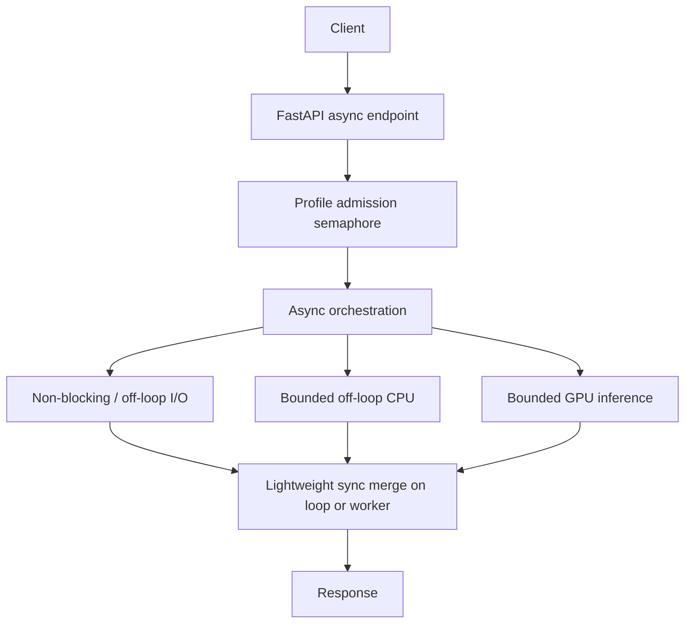

# NALUS Legal v2 — Production Async / Concurrency Architecture Plan

**Status:** AUTHORITATIVE IMPLEMENTATION BLUEPRINT  
**Date:** 2026-08-14  
**Git baseline:** `d0028a2` (`feat/legal-retrieval-benchmark`)  
**Prior audit:** `artifacts/legal_v2/production_async_audit_v1/` → verdict `NOT_PRODUCTION_ASYNC_SAFE`  
**Scope of this document:** planning only. No production code changes are implied by publishing this file.

---

## 1. Executive Summary

### Current state

Legal v2 Stage 1 product search is already **partially async-correct**:

- FastAPI entrypoint `POST /api/rag/legal-v2/case-similarity/search` is `async def` and awaits `search_case_similarity_stage1`.
- FAST / PRECISE hybrid retrieval runs via `asyncio.to_thread(LegalV2HybridRetriever.retrieve, ...)`.
- PRECISE CrossEncoder `rerank` also runs via `asyncio.to_thread`.
- BALANCED already overlaps hybrid and ColBERT with `asyncio.gather`, and ColBERT uses `asyncio.Semaphore(1)` + `to_thread`.
- Live smoke showed `/health` remaining responsive during a long PRECISE request → CE is not fake-async on the event loop.

It is **not yet fully production-safe for multi-user deploy** because:

1. CrossEncoder **predict** has no resource-level concurrency bound (load lock only).
2. Cold `get_case_similarity_stage1_runtime()` can block the event loop (sync `QdrantClient`, collection probes, dual retriever wiring).
3. No profile-level admission control (FAST/BALANCED/PRECISE).
4. Shared BGE encode + sync Qdrant across default threadpool threads without encode admission.
5. Timeouts / cancellation / backpressure are incomplete for Stage1 search.
6. Multi-worker uvicorn would duplicate BGE / CE / ColBERT process state.

### What is already correct (do not rewrite)

- Product profile contract: FAST = A hybrid; BALANCED = B + ColBERT; PRECISE = B + CE-7.
- Retrieval quality stack (chunkers, RRF, CE scoring, ColBERT scoring, models).
- ColBERT off-loop + semaphore pattern.
- CE / hybrid off-loop pattern (missing only CE predict bound + admission).
- Offline full-corpus adaptive embedding builder (ingest concern, separate from request async).

### What must change

- Bound GPU/CPU inference resources explicitly (CE especially).
- Move / gate cold runtime init off the event loop.
- Add profile admission + layered timeouts.
- Harden BGE/BM25 init and encode concurrency.
- Add concurrency metrics and readiness semantics.
- Enforce single-worker monolith until architecture changes.

### Architectural principle (non-negotiable)

```text
Async at orchestration / I/O boundaries.
Bounded off-loop execution for CPU/GPU blocking work.
No event-loop blocking.
No unbounded inference concurrency.
```

### Target outcome

After phased implementation, Stage1 must earn:

```text
PRODUCTION_ASYNC_SAFE
```

Meaning: multi-user concurrent FAST/BALANCED/PRECISE under configured limits, responsive health, no OOM from uncontrolled inference, unchanged retrieval quality unless a separate quality task approves changes.

---

## 2. Non-Goals

This roadmap is **not** trying to:

- Mechanically convert every `def` to `async def`.
- Rewrite retrieval quality logic, chunking, embeddings/models, RRF, CE scoring, or ColBERT scoring.
- Replace BM25 with another store, or force `aiosqlite` without measured need.
- Convert the offline full-corpus builder into a FastAPI async service.
- Introduce Celery / Kafka / Kubernetes / multi-service GPU mesh before MVP safety is done.
- Parallelize multiple CE or ColBERT inferences on one GPU “because they are independent”.
- Change product ranking semantics as a side effect of concurrency work.
- Make CPU PRECISE the latency target (production PRECISE is GPU-backed).

---

## 3. Current Architecture — Actual Codebase

### Product profiles (pinned)

| Profile | `retrieval_profile` | `retrieval_stage` | Indexes |
|---|---|---|---|
| FAST | `fast` | `hybrid_rrf_stage_1` | A hierarchical |
| BALANCED | `balanced` | `hybrid_rrf_colbert` | B contextual + ColBERT |
| PRECISE | `precise` (`ce7` alias) | `hybrid_rrf_ce7` | B contextual + CE-7 |

Source: `app/rag/legal_v2/retrieve/retrieval_profiles.py`.

### HTTP → response (common)

```text
POST /api/rag/legal-v2/case-similarity/search
  app/api/rag_router.py :: async def case_similarity_stage1_search
    → await search_case_similarity_stage1(...)
        app/rag/legal_v2/retrieve/case_similarity_search.py
```

Related:

- `GET /api/rag/legal-v2/case-similarity/ready` → sync `def case_similarity_stage1_ready` → `probe_case_similarity_stage1_readiness`
- `GET /health` → sync `def health` in `app/api/main.py`

### FAST call graph

```text
case_similarity_stage1_search
  search_case_similarity_stage1
    QueryInputService.prepare                  # query_input/service.py
    build_query_spec_v2                        # query/query_spec.py (imported as build_query_spec_v2)
    resolve_retrieval_profile("fast")
    get_case_similarity_stage1_runtime()
    LegalV2HybridRetriever (A) via to_thread
      QdrantDenseStore.search
        BgeM3Embedder.embed_query              # retrieval/bge_m3_embedder.py
        QdrantClient.query_points              # sync
      Bm25Sidecar.search                       # sequential after dense
      rrf_fuse                                 # retrieval/rrf.py
      aggregate / _aggregate_documents
    _to_stage1_document(...)
```

### BALANCED call graph

```text
search_case_similarity_stage1
  ...prep...
  retriever_for_profile → ce_retriever (B)
  _ensure_colbert_retriever
    PyLateColbertBackend.initialize → to_thread(_initialize_sync)
  retrieve_hybrid_plus_colbert                 # retrieve/colbert_hybrid.py
    gather(
      to_thread(hybrid.retrieve),              # dense→BM25 serial
      ColbertRetriever.retrieve
        PyLateColbertBackend.search
          Semaphore(concurrency_limit=1)       # Stage1 hardcodes 1
          to_thread(_search_sync)
    )
    rrf_fuse([dense, bm25, colbert])
    aggregate_legal_v2_documents(..., colbert=...)
```

### PRECISE call graph

```text
search_case_similarity_stage1
  ...prep...
  to_thread(ce_retriever.retrieve)             # B hybrid
  shortlist Stage1DocumentResult
  get_cross_encoder_reranking_service          # rerank/service.py singleton
  to_thread(service.rerank)
    DiversifiedStage1EvidenceSelectorV1
    SentenceTransformersCrossEncoderProvider.score
      load() under threading.Lock
      CrossEncoder.predict                     # NO predict semaphore
    aggregate_max_passage_scores
  rebuild ranked Stage1DocumentResult
```

### Hot-path inventory

| File | Function/Class | Kind | Work type | Current execution context | Risk |
|---|---|---|---|---|---|
| `app/api/rag_router.py` | `case_similarity_stage1_search` | `async def` | event-loop lightweight | event loop | Low (thin) |
| `app/api/rag_router.py` | `case_similarity_stage1_ready` | `def` | mixed probe | Starlette threadpool | Medium if cold |
| `app/api/main.py` | `health` | `def` | event-loop lightweight | Starlette threadpool | Low |
| `case_similarity_search.py` | `search_case_similarity_stage1` | `async def` | mixed | partial on loop | High if cold/unbounded CE |
| `case_similarity_search.py` | `get_case_similarity_stage1_runtime` | `def` | network I/O + CPU | **can run on loop** | **HIGH** |
| `case_similarity_search.py` | `warmup_case_similarity_stage1_runtime` | `def` | mixed | intended via `to_thread` | Low if used correctly |
| `case_similarity_search.py` | `_ensure_colbert_retriever` | `async def` | GPU/I/O | off-loop via backend | Low |
| `query_input/service.py` | `QueryInputService.prepare` | `def` | CPU | **on loop today** | Medium |
| query spec builder | `build_query_spec_v2` | `def` | CPU | **on loop today** | Medium |
| `retrieve/retriever.py` | `LegalV2HybridRetriever.retrieve` | `def` | mixed | via `to_thread` | Medium contention |
| `retrieval/qdrant_dense_store.py` | `QdrantDenseStore.search` | `def` | CPU + network | via `to_thread` | Medium |
| `retrieval/bge_m3_embedder.py` | `BgeM3Embedder.embed_*` | `def` | CPU | via `to_thread` | Medium (no encode lock) |
| `retrieval/bm25_sidecar.py` | `Bm25Sidecar.search` | `def` | CPU (+disk once) | via `to_thread` | Medium cold race |
| `colbert_hybrid.py` | `retrieve_hybrid_plus_colbert` | `async def` | mixed | gather | Low |
| `colbert/pylate_backend.py` | `PyLateColbertBackend.search` | `async def` | GPU | sem + `to_thread` | Low |
| `rerank/service.py` | `CrossEncoderRerankingService.rerank` | `def` | CPU+GPU | via `to_thread` | **HIGH** unbounded |
| `rerank/providers/cross_encoder.py` | `score` / `predict` | `def` | GPU/CPU | worker thread | **HIGH** |
| `retrieval/rrf.py` | `rrf_fuse` | `def` | CPU | worker / after gather | Low |
| `case_similarity_search.py` | `_to_stage1_document` | `def` | CPU | event loop after await | Low |

---

## 4. Target Enterprise Request Architecture

### Principle diagram



### Target FAST

```text
async endpoint
  acquire FAST admission (timeout)
  ensure runtime warm (no cold Qdrant on loop)
  prepare/query_spec off-loop if material
  to_thread OR future async Qdrant path:
      bounded BGE encode
      Qdrant dense
      BM25 (optionally parallel after Phase 4)
      RRF + aggregate
  map documents (lightweight)
  release admission
```

### Target BALANCED

```text
async endpoint
  acquire BALANCED admission
  ensure ColBERT ready
  gather(
    hybrid_off_loop(B),
    colbert_search under ColBERT resource semaphore(=1)
  )
  RRF3 + aggregate
  release admission
```

### Target PRECISE

```text
async endpoint
  acquire PRECISE admission (=1 default)
  hybrid_off_loop(B)
  acquire CE resource semaphore (=1 default)
    to_thread(rerank/predict)
  release CE resource
  release PRECISE admission
```

**Independent layers:**

1. **Profile admission** — how many HTTP Stage1 requests of that profile may be in-flight.
2. **Resource inference limit** — how many CE / ColBERT / BGE encodes may execute.

Never collapse these into one semaphore.

---

## 5. Async Boundary Rules

### MUST use native async for

- FastAPI Stage1 search orchestration.
- Waiting on admission / resource semaphores.
- Independent async branches that are already awaitable (ColBERT backend API).
- Future: AsyncQdrantClient query path, async Redis if query-cache is enabled for Stage1, async Postgres if added.
- Lifespan tasks that coordinate warmup without blocking startup forever.

### MAY remain synchronous `def`

- `rrf_fuse`, score aggregation, passage mapping helpers.
- Lightweight Pydantic / dataclass transforms.
- Pure config parsing and profile resolution.
- Small metadata normalization.

These may run either on the event loop (if truly tiny) or inside an already-offloaded worker function. Prefer keeping them inside the offloaded retrieve/rerank unit when uncertain.

### MUST execute off the event loop

- `BgeM3Embedder.embed_query` / `encode`
- `CrossEncoder.predict` / `rerank`
- ColBERT `_search_sync` / `_initialize_sync`
- Sync `QdrantClient` calls until AsyncQdrant migration
- BM25 SQLite cold load and (if profiled material) search
- Cold Stage1 runtime construction (`get_case_similarity_stage1_runtime` body)
- Material long-input condensation CPU work

### Hard rule

> Never classify CPU/GPU work as safe merely because it is inside `async def`.

---

## 6. `asyncio.gather` Policy

### SAFE (keep / extend carefully)

| Opportunity | Status | Notes |
|---|---|---|
| Hybrid ‖ ColBERT | **Already implemented** in `retrieve_hybrid_plus_colbert` | Keep; both arms off-loop / sem-bounded |
| Health probes of independent cheap checks | Optional | Not on search hot path |

### CONDITIONAL

| Opportunity | Condition |
|---|---|
| Dense ‖ BM25 | Only after BGE encode semaphore + confirmed Qdrant client thread-safety policy; both remain in threads/executors; do not gather on-loop blockers |
| Parallel readiness dependency checks | Cheap only; never run inference |

### FORBIDDEN / USELESS

- Gathering multiple CE predicts against one GPU.
- Gathering multiple ColBERT searches beyond resource semaphore.
- Gathering unbounded per-document / per-chunk remote calls.
- Gathering two sync functions directly on the event loop and calling it “parallelism”.

### Gather semantics requirements

- Bound task count (fixed 2 for hybrid‖ColBERT; never N=candidates).
- Use default `return_exceptions=False` for product path unless explicit partial-degrade contract exists (today: fail closed).
- On cancellation: do not start new arms; do not assume in-flight `to_thread` stops (see §16).

---

## 7. FastAPI Event Loop Safety

Acceptance criterion:

> No request path may perform a materially blocking operation directly on the FastAPI event-loop thread.

| Severity | File | Function | Current behavior | Target behavior |
|---|---|---|---|---|
| HIGH | `case_similarity_search.py` | `get_case_similarity_stage1_runtime` | Sync Qdrant + wiring may run on loop | Construct via `to_thread` / eager warmup; search requires warm runtime |
| HIGH | `cross_encoder.py` | `score`/`predict` | Off-loop but unbounded concurrent threads | Resource semaphore around CE inference |
| MEDIUM | `query_input/service.py` | `prepare` | Sync on loop | Off-loop when long-input/CPU material |
| MEDIUM | query spec | `build_query_spec_v2` | Sync on loop | Off-loop if measured material; else keep tiny |
| MEDIUM | `bge_m3_embedder.py` + `qdrant_dense_store.py` | encode + `query_points` | Off-loop, shared, unlocked | Encode/Qdrant admission; keep off-loop |
| LOW | `case_similarity_search.py` | `_to_stage1_document` | Sync after await | Keep if small; else fold into worker |
| MITIGATED | `retriever.py` / ColBERT / CE rerank call sites | retrieve/search/rerank | Already `to_thread` | Preserve |

---

## 8. Runtime Initialization Architecture

### Process-local singletons (current + target)

| Resource | Owner today | Load policy target |
|---|---|---|
| Stage1 runtime | `_runtime` + `_runtime_lock` in `case_similarity_search.py` | Eager at lifespan warmup; search refuses cold path on loop |
| Sync Qdrant client | inside runtime | Create during off-loop init; reuse forever |
| BGE-M3 | `runtime.embedder` | Warm at startup (`embedder.load` + warmup query) |
| BM25 A + B | sidecars on dual retrievers | Warm both at startup (`search(warmup)` once) |
| CrossEncoder service | `get_cross_encoder_reranking_service` | Eager if PRECISE master-allow on; else lazy with load lock |
| ColBERT backend | `runtime.colbert_retriever` + `_colbert_init_lock` | Eager if BALANCED master-allow on; else lazy async init |

### Rules

1. Double-checked locking remains for singleton creation.
2. Blocking construction never runs on the event-loop thread.
3. Failed init sets typed error state; readiness reflects it; search returns controlled 503.
4. No duplicate model loads under concurrent first requests (CE load lock already; extend to runtime/BM25 load).
5. Lifespan already schedules `_warmup_stage1_bg` via `to_thread` — keep and harden as the primary warm path.

### Eager vs lazy

- **Eager (startup):** runtime shell, Qdrant client, BGE, BM25 A/B, optionally CE/ColBERT when env master-allow is on.
- **Lazy:** ColBERT/CE when master-allow off at boot but enabled later is unsupported without restart (prefer restart with env). Avoid half-initialized multi-user races.

---

## 9. Qdrant Migration Plan

### CURRENT (MVP-safe if off-loop)

- Client: sync `qdrant_client.QdrantClient`
- Constructed once in `get_case_similarity_stage1_runtime` (`timeout=10`)
- Used by `QdrantDenseStore.search` → `query_points`
- Shared by FAST and B retrievers
- No `AsyncQdrantClient` in repo today

### TARGET (Phase 3)

Evaluate / migrate request-path dense queries to `AsyncQdrantClient` while keeping the same collection/schema.

### Phases

1. **P0/P1:** Keep sync client; ensure all query calls remain in `to_thread`; fix cold init off-loop; add timeouts metrics.
2. **Phase 3a:** Introduce async client behind internal adapter (`DenseStore` protocol) with feature flag / config switch.
3. **Phase 3b:** Dual-run equivalence tests (same query → same point IDs/order within tie tolerance).
4. **Phase 3c:** Default async path; remove sync query from request path (sync may remain for offline scripts).

### Lifecycle rules

- Singleton per process; never per-request construction.
- Explicit timeouts on every query.
- Retries: only idempotent read retries with jitter; no retry storm (cap 1–2).
- Cancellation: async client can cancel awaits; sync-in-thread cannot (document residual work).
- Failure → 503 unavailable (existing Stage1 pattern), never empty success.

### Files

- `app/rag/legal_v2/retrieve/case_similarity_search.py`
- `app/rag/retrieval/qdrant_dense_store.py`
- possibly new `app/rag/retrieval/async_qdrant_dense_store.py`
- tests under `tests/rag/`

---

## 10. BM25 / SQLite Architecture

### Current

- `app/rag/retrieval/bm25_sidecar.py` :: `Bm25Sidecar`
- First `search`: `sqlite3.connect` → load records → build in-memory `_Bm25Index`
- Subsequent searches: pure in-memory CPU
- Stage1 holds two sidecars (A FAST, B CE/BALANCED)

### Target

- Startup warmup loads both indexes.
- Add `threading.Lock` (or asyncio-safe init gate) around first load.
- After load: treat index as immutable read-only; concurrent search OK.
- Keep search sync and off-loop inside hybrid `to_thread` for MVP.
- **Do not** mandate `aiosqlite` — SQLite is not on the steady-state request path after warm.

### Decision point

If profiling shows BM25 CPU dominates FAST latency under concurrency, options (later):

1. Bound BM25 with a CPU semaphore.
2. Keep serial dense→BM25 but raise FAST admission thoughtfully.
3. Parallel dense‖BM25 after locks (Phase 4).

---

## 11. BGE-M3 Query Embedding Architecture

### Current

- `BgeM3Embedder` singleton on Stage1 runtime, shared by A and B dense stores.
- Production path enforces **CPU-only** (`device != cpu` raises).
- `SentenceTransformer.encode(..., batch_size=1, normalize_embeddings=True)`.
- No encode lock; concurrent `to_thread` retrieves may overlap encode.

### Target policy (initial)

| Knob | Initial value | Rationale |
|---|---|---|
| Process copies | 1 | Shared singleton |
| Device | CPU (unchanged) | Quality/deploy contract |
| Encode concurrency | **2** (config; floor 1) | Allows modest FAST overlap without uncontrolled thrash |
| Cross-request micro-batching | **Off** (P2) | Complexity; quality-neutral only if carefully designed |

### Rules

- Encode always off-loop.
- Semaphore around encode (resource layer), independent of FAST admission.
- No model/path/dimension/normalization changes in this roadmap.
- Raise encode concurrency only after load test evidence.

---

## 12. CrossEncoder / PRECISE Architecture

### Current

- Singleton: `get_cross_encoder_reranking_service` + `_service_lock` (`rerank/service.py`)
- Provider load lock: `SentenceTransformersCrossEncoderProvider._lock`
- Predict: unlocked `CrossEncoder.predict` batches
- Stage1 call: `await asyncio.to_thread(lambda: service.rerank(...))`
- Product: B shortlist + diversified passages + CE-7 (`hybrid_rrf_ce7`)
- GPU target for production; laptop GPU warm CE previously ~7–8 s; CPU PRECISE is not the target

### Target

Two layers:

1. **PRECISE profile admission** default `1`
2. **CE inference resource semaphore** default `1`

Illustrative orchestration (adapt to real helpers; do not paste blindly into code without review):

```python
await asyncio.wait_for(precise_admission.acquire(), timeout=admission_timeout)
try:
    # hybrid already completed under admission
    await asyncio.wait_for(ce_inference_semaphore.acquire(), timeout=ce_wait_timeout)
    try:
        reranked = await asyncio.to_thread(service.rerank, query, shortlist, True)
    finally:
        ce_inference_semaphore.release()
finally:
    precise_admission.release()
```

### Required properties

- Load remains double-checked under lock.
- Predict/rerank always under CE resource semaphore.
- No semaphore leak on exceptions/cancellation of waiter.
- Saturation: wait until timeout then **429 or 503** (see §14/§20) — never unbounded queue growth.
- CUDA OOM → typed `RerankerInferenceError` → HTTP 503 (existing mapping family).
- **No silent degrade** PRECISE → FAST/BALANCED.

### Timeouts

- Admission wait timeout (profile)
- CE resource wait timeout
- Optional inference wall-clock timeout (cooperative at batch boundaries only; hard kill of GPU thread is not reliable)

---

## 13. ColBERT / BALANCED Architecture

### Current (already close to target)

- `ColbertConfig.concurrency_limit` default 1
- Stage1 `_colbert_config_from_env` **hardcodes** `concurrency_limit=1` (not env-driven today)
- `PyLateColbertBackend`: `asyncio.Semaphore` + `to_thread(_search_sync)`
- Init: backend lock + `_colbert_init_lock`
- BALANCED gather hybrid‖ColBERT already correct

### Target

- Keep resource concurrency default **1**.
- Wire env override `NALUS_LEGAL_V2_COLBERT_MAX_CONCURRENCY` (or reuse/extend existing ColBERT env family) — still default 1.
- Add BALANCED profile admission default **4**.
- Master-allow remains `NALUS_LEGAL_V2_COLBERT_ENABLED=1`; disabled → controlled 503 (current behavior).
- Do not gather multiple ColBERT searches per request.

---

## 14. Admission Control

### Initial safety defaults (configurable)

| Profile | Max in-flight | Purpose |
|---|---|---|
| FAST | 8 | Interactive throughput without melting CPU/threadpool |
| BALANCED | 4 | Hybrid + ColBERT queue pressure |
| PRECISE | 1 | Align with single CE GPU slot |

These are **safety defaults**, not capacity claims. Load-test before raising.

### Implementation target

- Process-local `asyncio.Semaphore` per profile, owned by Stage1 orchestration module.
- Acquire with timeout (`LEGAL_V2_ADMISSION_TIMEOUT_SECONDS`).
- On timeout / saturation: prefer **HTTP 429** with stable detail code for client retry; if existing public contract must stay 5xx-only short-term, use **503** with distinct `status` metric label `admission_saturated` and document migration to 429.
- Current Stage1 errors already use 422 / 503 / 404 — introducing 429 is allowed if FE contract updated in same phase.
- Metrics: active, waiting, wait seconds, saturation count (low-cardinality labels: `profile` only).

### Non-goals of admission

- Not a substitute for edge rate limiting.
- Not a substitute for CE/ColBERT resource semaphores.

---

## 15. Timeout Architecture

| Layer | Proposed knob | Suggested default | Applies to |
|---|---|---|---|
| Reverse proxy / client | infra | 60s FAST, 120s BALANCED, 180s PRECISE (GPU) | outer |
| Admission wait | `LEGAL_V2_ADMISSION_TIMEOUT_SECONDS` | 5s | semaphore wait |
| Qdrant client | keep/adjust `QdrantClient(timeout=...)` | 10s (current) | dense query |
| CE resource wait | `LEGAL_V2_CE_WAIT_TIMEOUT_SECONDS` | 10s | waiting for CE slot |
| ColBERT resource wait | backend already queues on sem | inherit admission | waiting for ColBERT slot |
| Inference execution | soft budget metrics first | no hard kill MVP | CE/ColBERT running |
| Query prep off-loop | optional | 5–15s if moved | long input |

Avoid one giant global timeout that conflates wait vs execute.

Client mapping:

- admission wait timeout → 429/503 saturation
- dependency timeout → 503 unavailable
- validation → 422 (existing)

---

## 16. Cancellation Architecture

Facts to respect:

- Cancelling an `asyncio.Task` waiting on a semaphore is safe if `try/finally` releases only owned permits.
- Cancelling `await asyncio.to_thread(...)` **does not stop** the worker thread mid-encode/predict.
- GPU kernels already submitted will run to completion.

### Safe policy

1. Waiters cancelled before acquire: no permit taken.
2. After acquire, always release in `finally`.
3. If request cancelled during `to_thread`: allow worker to finish; do not start additional GPU work for that request; metrics mark `cancelled`.
4. Do not attempt `torch` thread kill.
5. Do not reuse partial CE outputs after cancellation.
6. Proxy disconnect should cancel the endpoint task; residual GPU work is accepted cost under concurrency=1.

---

## 17. Backpressure and Queueing

### MVP

- Profile admission semaphores + resource semaphores are sufficient.
- No explicit multi-consumer GPU queue process.
- No unbounded `create_task` fan-out.

### Future (Phase 7)

- Dedicated GPU inference service with bounded queue depth.
- Queue size = small multiple of GPU concurrency (e.g. depth 8 with CE concurrency 1).
- On queue full: reject fast (429) rather than accept infinite wait.

---

## 18. Uvicorn / Process Model

### Current

`Dockerfile`:

```text
CMD ["uvicorn", "app.api.main:app", "--host", "0.0.0.0", "--port", "8000"]
```

Compose maps host `8029→8000` (`docker-compose.yml` / stage1 overlays). One API container process → one model set. Correct for monolith ML.

### Target MVP contract

- **Exactly one** uvicorn worker / process for Legal v2 GPU-capable API.
- Document in compose/Dockerfile comments and ops runbook.
- Forbid naive `--workers N` while BGE/CE/ColBERT are in-process.

### Before multiple API workers become safe

Must have either:

1. Externalized inference service (models not in API workers), or
2. Worker-local models with strict capacity planning and sticky routing (generally inferior).

---

## 19. Future Dedicated GPU Inference Service

Future-only (Phase 7). Not MVP.

```text
FastAPI API (N replicas, CPU)
  → async inference client
  → bounded queue
  → GPU worker service
       → BGE encode (if moved)
       → ColBERT
       → CrossEncoder
```

Split when:

- API CPU scale needs >1 replica while GPU remains 1, or
- Model memory prevents co-locating, or
- Batching across requests becomes necessary.

Until then, keep in-process bounded inference.

---

## 20. Error Handling

| Failure | Client behavior | Silent degrade? |
|---|---|---|
| CUDA OOM / CE inference error | 503 unavailable | **No** |
| CE/ColBERT master-allow off or missing index | 503 / config error (existing) | **No** |
| Qdrant down | 503 | **No** |
| BM25 missing/unwarmed | 503 | **No** |
| Admission saturation | 429 (preferred) or 503+metric | **No** |
| Validation / blank query / limit | 422 (existing) | N/A |
| Cancellation | 499/connection drop; server metrics `cancelled` | N/A |
| Runtime init failure | readiness false + 503 on search | **No** |

Product rule: **never silently switch PRECISE→BALANCED/FAST**.

---

## 21. Observability

Extend existing `app/observability/legal_v2_metrics.py` patterns (low-cardinality labels only).

### Proposed metrics (names illustrative; keep `nalus_legal_v2_` prefix)

| Metric | Labels | Purpose |
|---|---|---|
| `nalus_legal_v2_stage1_requests_total` | `profile`, `status` | request outcomes |
| `nalus_legal_v2_stage1_latency_seconds` | `profile`, `status` | e2e |
| `nalus_legal_v2_admission_active` | `profile` | gauge/semaphore used |
| `nalus_legal_v2_admission_wait_seconds` | `profile` | wait histogram |
| `nalus_legal_v2_admission_saturated_total` | `profile` | rejects |
| `nalus_legal_v2_infer_active` | `resource` (`bge`/`ce`/`colbert`) | in-flight inference |
| `nalus_legal_v2_infer_latency_seconds` | `resource` | pure infer time |
| `nalus_legal_v2_infer_wait_seconds` | `resource` | resource sem wait |
| `nalus_legal_v2_qdrant_query_seconds` | `collection_role` (`fast`/`ce`) | dense latency |
| `nalus_legal_v2_bm25_query_seconds` | `index_role` | bm25 latency |
| `nalus_legal_v2_runtime_init_seconds` | `status` | cold init |
| `nalus_legal_v2_oom_total` | `resource` | OOM count |

Never label with raw query, ECLI, document id, user id, or error message text.

GPU utilization/VRAM: export via existing node/cadvisor or a small safe gauge if already patterned; do not scrape high-cardinality sources.

---

## 22. Logging / Correlation

Use existing observability middleware / `trace_event` patterns.

Log fields (structured):

- `request_id` / correlation id (existing context)
- `retrieval_profile`
- `retrieval_stage`
- timings: prep_ms, dense_ms, bm25_ms, colbert_ms, ce_ms, admission_wait_ms
- error stage + exception **type** (not full stack in info logs)
- saturation events

Do **not** log full legal query text by default (`NALUS_LEGAL_V2_DEBUG` remains gated).

---

## 23. Health / Readiness

| Endpoint | Role | Checks |
|---|---|---|
| `GET /health` | liveness | process up; must stay cheap; **must remain responsive under load** (smoke already validates directionally) |
| `GET /api/rag/legal-v2/case-similarity/ready` | readiness | enabled flag, runtime warm, BM25 loaded, model loaded, optional CE/ColBERT readiness when master-allow on |

Rules:

- Ready must not run full CE predict each call.
- Search should fail closed if ready would be false for required deps.
- Distinguish `disabled` vs `starting` vs `ready` vs `error` (partially present today).

---

## 24. Configuration Contract

Proposed env knobs (documentation only until implemented):

| Variable | Default | Range | Purpose | Prod recommendation |
|---|---|---|---|---|
| `NALUS_LEGAL_V2_FAST_MAX_CONCURRENCY` | 8 | 1–64 | FAST admission | start 8 |
| `NALUS_LEGAL_V2_BALANCED_MAX_CONCURRENCY` | 4 | 1–32 | BALANCED admission | start 4 |
| `NALUS_LEGAL_V2_PRECISE_MAX_CONCURRENCY` | 1 | 1–8 | PRECISE admission | **1** on single GPU |
| `NALUS_LEGAL_V2_CE_MAX_CONCURRENCY` | 1 | 1–4 | CE resource slots | **1** |
| `NALUS_LEGAL_V2_COLBERT_MAX_CONCURRENCY` | 1 | 1–4 | ColBERT resource slots | **1** |
| `NALUS_LEGAL_V2_BGE_MAX_CONCURRENCY` | 2 | 1–16 | encode slots | 2, tune later |
| `NALUS_LEGAL_V2_ADMISSION_TIMEOUT_SECONDS` | 5 | 0.1–60 | wait for profile slot | 5 |
| `NALUS_LEGAL_V2_CE_WAIT_TIMEOUT_SECONDS` | 10 | 0.1–120 | wait for CE slot | 10 |
| `NALUS_LEGAL_V2_STAGE1_REQUIRE_WARM` | 1 | 0/1 | reject search if not warm | **1** |
| existing master-allows | — | — | ColBERT/CE enable | keep |

Do not invent unused code knobs in Phase 0.

---

## 25. Testing Strategy

### UNIT

- Semaphore acquire/release/leak on exception
- Admission timeout behavior
- CE resource bound (mock predict; assert max concurrent ≤ N)
- Runtime init race (concurrent get_runtime)
- BM25 load lock
- Config parsing ranges

### INTEGRATION

- Warmup path off-loop
- Mocked Qdrant/BGE/CE/ColBERT concurrency
- Ready vs search fail-closed when cold/disabled

### API

- Concurrent FAST/BALANCED/PRECISE HTTP
- Saturation → expected status
- `/health` during PRECISE load

### LOAD (after P0/P1)

| Profile | Concurrencies |
|---|---|
| FAST | 1 / 5 / 10 / 20 |
| BALANCED | 1 / 3 / 5 (+ higher only after safety) |
| PRECISE | many HTTP callers, CE active ≤ configured resource limit |

Also: cold-start race, Qdrant outage, cancellation, OOM mocked.

Reuse/extend:

- `tests/rag/test_legal_v2_*`
- prior runners: `scripts/legal_v2/smoke_retrieval_tiers_staging_v1.py`, CPU/GPU latency benchmarks
- audit smoke: `artifacts/legal_v2/production_async_audit_v1/_run_concurrency_smoke.py`

---

## 26. Performance Acceptance Criteria

Absolute product SLOs should be set with product owners; engineering safety gates:

### FAST

- No material event-loop blocking (health p95 remains low under load).
- Under admission limit: success rate ≥ 99% in soak; no deadlock.
- Latency may rise with concurrency but must not collapse process.

### BALANCED

- ColBERT active ≤ configured resource limit.
- No CUDA OOM under admission.
- Health remains responsive.

### PRECISE

- CE active ≤ configured resource limit (**1** initially).
- Excess callers wait ≤ timeout then clean fail.
- No uncontrolled VRAM growth across soak.
- GPU PRECISE warm latency class remains product-acceptable (historically ~7–8 s on RTX 4060 laptop for CE path in prior latency tier runs — re-measure on target host).

### Global

- Zero semaphore leaks / deadlocks
- Zero duplicate runtime/model init under concurrency
- Retrieval outputs unchanged vs golden baselines for same profile (quality invariant)

---

## 27. Security / Abuse Resistance

- Keep `MAX_QUERY_LENGTH = 8000` and request validation.
- Admission control ≠ edge rate limit: both needed.
- PRECISE is expensive: plan-level auth / quotas later; until then admission+timeouts blunt abuse.
- Do not log full queries by default.
- AuthN/Z unchanged by this roadmap; do not weaken flags to make tests pass.

---

## 28. Deployment Sequence (Phased Implementation)

### PHASE 0 — Freeze & baseline

- **Goal:** capture current behavior and tests as baseline.
- **Steps:** keep this doc + audit artifacts; run focused Stage1 tests; optional concurrency smoke snapshot.
- **Files:** docs only (this file).
- **Tests:** existing unit/integration green.
- **Acceptance:** blueprint reviewed; no code change required.
- **Rollback:** N/A
- **Commit boundary:** docs-only commit when asked.
- **HARD STOP:** do not start Phase 1 without go-ahead.

### PHASE 1 — P0 concurrency safety

- **Goal:** CE resource bound; cold runtime off-loop; single-worker contract.
- **Likely files:** `case_similarity_search.py`, `rerank/service.py`, `cross_encoder.py`, `main.py` lifespan, `Dockerfile`/compose comments, tests.
- **Steps:**
  1. Add CE inference semaphore (default 1).
  2. Ensure runtime init + warm only via `to_thread` / startup; search requires warm.
  3. Document/enforce 1 uvicorn worker.
- **Tests:** concurrent PRECISE mock; cold-init not on loop; worker contract test/docs.
- **Acceptance:** concurrent PRECISE cannot run >1 predict; health stays responsive; no quality change.
- **Rollback:** revert commit; feature flag optional but not required if change is small/safe.
- **HARD STOP:** no AsyncQdrant yet; no admission matrix yet if deferred to Phase 2 (prefer including PRECISE admission=1 here if cheap).

### PHASE 2 — Admission / timeouts / BGE-BM25 harden

- **Goal:** profile admission + timeouts + BGE/BM25 locks.
- **Likely files:** `case_similarity_search.py`, `rag_router.py`, `bge_m3_embedder.py`, `bm25_sidecar.py`, metrics module, tests.
- **Acceptance:** FAST/BALANCED/PRECISE saturations clean; no BM25 load race; encode bounded.
- **HARD STOP:** no gather dense‖BM25 yet.

### PHASE 3 — Native async I/O (Qdrant)

- **Goal:** AsyncQdrantClient on request path (flagged).
- **Acceptance:** equivalence vs sync path; cancel-friendly awaits; singleton lifecycle.
- **HARD STOP:** no quality knob changes.

### PHASE 4 — Orchestration optimization

- **Goal:** optional dense‖BM25 if validated; trim residual sync-on-loop prep.
- **Acceptance:** latency improvement without quality drift; still bounded.
- **HARD STOP:** no GPU parallelization beyond resource limits.

### PHASE 5 — Observability / readiness polish

- **Goal:** metrics in §21; readiness/liveness clarity.
- **Acceptance:** dashboards/alerts possible; labels low-cardinality.

### PHASE 6 — Production concurrency / load validation

- **Goal:** soak on target hardware with GPU PRECISE.
- **Acceptance:** meets §26; verdict can move to `PRODUCTION_ASYNC_SAFE`.
- **HARD STOP:** if OOM or health collapse, lower limits — do not “fix” with more workers.

### PHASE 7 — Optional GPU inference service

- **Goal:** split API replicas from GPU worker when scale demands.
- **Acceptance:** contract + queue metrics + no quality change.
- **HARD STOP:** only after Phase 6 green.

---

## 29. Atomic Commit Plan (future implementation)

Suggested commit boundaries (adjust names to fit diff reality):

1. `docs(legal-v2): add production async architecture plan` *(this document)*
2. `fix(legal-v2): bound CrossEncoder inference concurrency`
3. `fix(legal-v2): move Stage1 runtime initialization off event loop`
4. `feat(legal-v2): add Stage1 profile admission control`
5. `fix(legal-v2): harden BGE encode and BM25 load concurrency`
6. `feat(legal-v2): add Stage1 concurrency and inference metrics`
7. `refactor(legal-v2): add AsyncQdrant request path behind adapter`
8. `perf(legal-v2): optional dense/BM25 parallel retrieval`
9. `chore(legal-v2): enforce single-worker production contract`

Never combine CE semaphore + AsyncQdrant + gather optimization in one commit.

---

## 30. Rollback Strategy

| Change | Rollback |
|---|---|
| CE semaphore | revert commit; behavior returns to unbounded predict (worse) — only roll back if semaphore bug; prefer fix-forward |
| Runtime off-loop init | revert; keep warmup-on-start as mitigation |
| Admission control | env set high limits or revert; monitor saturation metrics |
| AsyncQdrant | config switch back to sync off-loop store |
| Worker count | compose/Dockerfile pin `--workers 1` |

Prefer config lowering of concurrency over emergency multi-worker scaling.

---

## 31. Deployment Topology — MVP

```text
Client
  → reverse proxy (optional Nginx)
  → nalus API container
       uvicorn app.api.main:app   # ONE process
       Stage1 async orchestration
       bounded to_thread / semaphores
  → Qdrant service (compose `qdrant`)
  → Redis (optional caches; not required for Stage1 core)
  → local BM25 sqlite sidecars (loaded in-memory)
  → GPU host device (for CE/ColBERT when enabled)
```

Matches current compose shape (`docker-compose.yml` / `docker-compose.stage1.local.yml` / GPU overlays) with Stage1 flags.

---

## 32. Deployment Topology — Future Scale

```text
Load balancer
  → N × API replicas (CPU, no giant models) 
  → shared Qdrant
  → dedicated GPU inference service / queue
       → CE / ColBERT (/ optional BGE)
```

State ownership:

- Qdrant: shared durable vectors
- BM25: either baked into API image storage or shared volume with immutable warm load
- Models: owned by GPU service
- Admission: per-replica local + global edge rate limits

---

## 33. Relationship to Full-Corpus Index Build

- This async roadmap **does not** change A/B chunking, embedding model, dims, or payload schema.
- Full A / full B / ColBERT index builds remain **offline ingest** (`scripts/legal_v2/build_full_corpus_ab_indexes_v1.py` adaptive scheduler, etc.).
- Adaptive GPU batching is an ingest execution concern (~36 h A estimate) and must not be redesigned as request-path async.
- After full indexes exist, Stage1 bindings switch from `*_300` pilot collections to `*_full` via existing env/binding mechanisms — without changing concurrency architecture.
- **Do not** block or couple Phase 1–2 API safety work on full A completion, and do not start full A as part of async implementation phases unless product ops explicitly schedules it separately.

---

## 34. Definition of Done

Ship `PRODUCTION_ASYNC_SAFE` only when all are true:

- [ ] No known material blocking I/O/init on the event-loop request path
- [ ] Heavy CPU/GPU isolated off-loop
- [ ] CE concurrency bounded and tested
- [ ] ColBERT concurrency bounded (default 1) and tested
- [ ] BGE encode concurrency explicitly controlled
- [ ] Profile admission bounded with timeout + clean saturation response
- [ ] No unlimited waiting / unbounded task fan-out
- [ ] Timeout + cancellation policy implemented and documented
- [ ] No semaphore leaks under fault injection
- [ ] Cold runtime race-safe; BM25 load race-safe
- [ ] Qdrant client lifecycle singleton-safe
- [ ] Single-worker monolith enforced until Phase 7 architecture
- [ ] `/health` remains responsive under retrieval load
- [ ] Concurrency metrics present for admission + inference
- [ ] Load/concurrency tests green on target GPU host
- [ ] FAST / BALANCED / PRECISE still supported
- [ ] Retrieval quality unchanged unless separate approval

---

## 35. Open Decisions / Questions

Only items not fully decidable from the repository alone:

### Q1. Admission saturation HTTP status: 429 vs 503

- **Why it matters:** FE/retry semantics and monitoring.
- **Options:** 429 (correct for capacity), 503 (matches today’s Stage1 unavailable style).
- **Recommended default:** **429** for admission saturation; keep 503 for dependency failures.
- **Evidence needed:** FE contract check + short product confirmation.

### Q2. Target host GPU PRECISE SLO numbers

- **Why:** acceptance thresholds for p95.
- **Options:** reuse laptop GPU tier (~7–8 s CE path) vs measure on VPS.
- **Recommended default:** engineer safety gates first; set numeric SLO after VPS measure.
- **Evidence needed:** Phase 6 benchmark on production-like GPU.

### Q3. Whether Phase 1 includes full profile admission or only CE resource bound

- **Why:** scope control.
- **Options:** (A) CE semaphore only; (B) CE semaphore + PRECISE admission=1; (C) full FAST/BALANCED/PRECISE admission matrix.
- **Recommended default:** **B** in Phase 1, full matrix in Phase 2.
- **Evidence needed:** none beyond implementation capacity.

### Q4. AsyncQdrant migration priority vs post-full-corpus cutover

- **Why:** scheduling against 36 h A build ops.
- **Options:** API P0/P1 before/during/after full A.
- **Recommended default:** **P0/P1 API safety independent** of full A; Phase 3 AsyncQdrant after P0/P1; full A scheduled as separate ops track.
- **Evidence needed:** ops calendar only.

---

## Appendix A — Code paths inspected

- `app/api/rag_router.py` (Stage1 search/ready)
- `app/api/main.py` (lifespan, health, warmup task)
- `app/rag/legal_v2/retrieve/case_similarity_search.py`
- `app/rag/legal_v2/retrieve/retrieval_profiles.py`
- `app/rag/legal_v2/retrieve/retriever.py`
- `app/rag/legal_v2/retrieve/colbert_hybrid.py`
- `app/rag/legal_v2/retrieve/colbert/pylate_backend.py`
- `app/rag/legal_v2/retrieve/colbert/config.py`
- `app/rag/legal_v2/rerank/service.py`
- `app/rag/legal_v2/rerank/providers/cross_encoder.py`
- `app/rag/retrieval/bge_m3_embedder.py`
- `app/rag/retrieval/bm25_sidecar.py`
- `app/rag/retrieval/qdrant_dense_store.py`
- `app/observability/legal_v2_metrics.py`
- `Dockerfile`, `docker-compose.yml`, Stage1/GPU compose overlays
- `artifacts/legal_v2/production_async_audit_v1/*`
- Existing tests/scripts referenced in PROJECT_PROGRESS for staging/CPU/GPU latency

## Appendix B — Indexing dependency (read-only)

Adaptive 2k preflight verified; full A not started; estimated ~36 h A embed on tested RTX 4060. Async API plan must preserve A/B/ColBERT index semantics.
